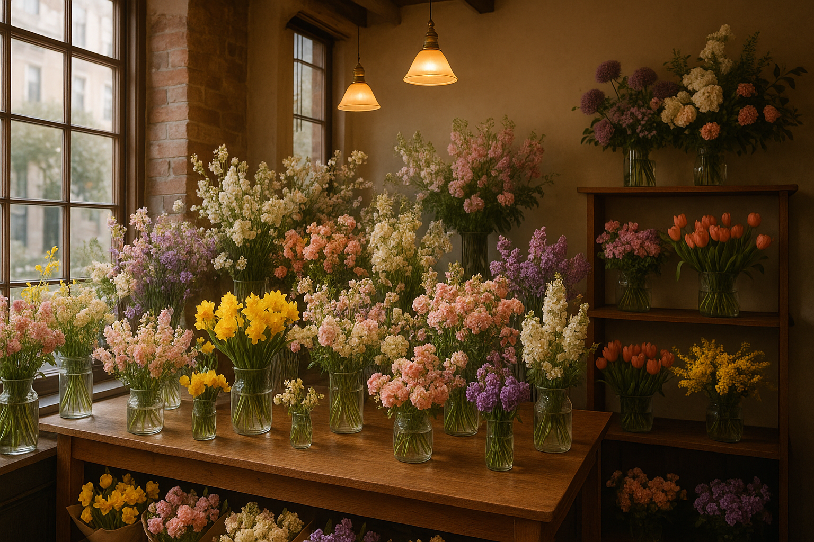

# 바이브꽃집 랜딩 페이지

서초구 고속터미널 내 위치한 감성 꽃집, **바이브꽃집**의 공식 랜딩 페이지입니다.



## 🌸 프로젝트 소개

바이브꽃집은 "자연을 담은, 당신만의 꽃집"이라는 슬로건으로 고객들에게 감성적이고 특별한 꽃 경험을 제공하는 꽃집입니다. 이 웹사이트는 오프라인 매장 방문을 유도하고 매장 정보를 제공하는 것을 목적으로 합니다.

## ✨ 주요 기능

- 📸 **상품 갤러리**: 기념일, 생일, 장식용으로 분류된 꽃 상품들
- 💬 **고객 후기**: 실제 고객들의 생생한 후기
- 📍 **매장 정보**: 위치, 운영시간, 연락처 및 지도
- 📱 **반응형 디자인**: 모바일과 데스크톱 모든 환경에서 최적화

## 🛠 기술 스택

- **HTML5**: 시맨틱 마크업
- **CSS3**: 반응형 디자인, 플렉스박스, 그리드
- **Vanilla JavaScript**: 탭 기능 및 인터랙션
- **Google Fonts**: Noto Sans KR, Noto Serif KR

## 📁 프로젝트 구조

```
my-landing-page/
├── index.html          # 메인 HTML 파일
├── style.css           # 모든 스타일시트
├── main.js            # JavaScript 로직
├── assets/
│   └── images/        # 이미지 파일들
│       ├── anniversary-1.png
│       ├── anniversary-2.png
│       ├── anniversary-3.png
│       ├── birthday-1.png
│       ├── birthday-2.png
│       ├── birthday-3.png
│       ├── deco-1.png
│       ├── deco-2.png
│       ├── deco-3.png
│       └── flower-shop.png
└── README.md          # 프로젝트 문서
```

## 🚀 설치 및 실행

### 필요 사항
- 웹 브라우저 (Chrome, Firefox, Safari, Edge 등)
- (선택사항) 로컬 서버 (Live Server, Python SimpleHTTPServer 등)

### 실행 방법

1. **저장소 클론**
   ```bash
   git clone <repository-url>
   cd my-landing-page
   ```

2. **브라우저에서 실행**
   - `index.html` 파일을 더블클릭하여 브라우저에서 열기
   - 또는 로컬 서버를 사용하여 실행

3. **Live Server 사용 (VS Code)**
   - VS Code의 Live Server 확장을 설치
   - `index.html`에서 우클릭 → "Open with Live Server"

## 📋 파일별 역할

### `index.html`
- 메인 HTML 진입점
- `style.css`와 `main.js` 연결
- 시맨틱 HTML 태그 사용으로 SEO 최적화

### `style.css`
- 모든 CSS 스타일 정의
- 모바일 우선 반응형 디자인 접근법
- 클래스 선택자 중심의 스타일링

### `main.js`
- 갤러리 탭 기능 구현
- 이벤트 리스너 및 동적 콘텐츠 관리
- DOM 조작을 통한 인터랙션

### `assets/images/`
- 웹사이트에서 사용되는 모든 이미지
- 상품 사진들이 카테고리별로 명명됨

## 🎨 디자인 특징

- **한국적 감성**: 한글 폰트와 자연스러운 색감
- **모바일 퍼스트**: 작은 화면부터 설계한 반응형 디자인
- **직관적 네비게이션**: 섹션별 앵커 링크로 부드러운 스크롤
- **사용자 경험**: 탭을 통한 갤러리 필터링 기능

## 📞 매장 정보

- **이름**: 바이브꽃집
- **주소**: 서울 서초구 신반포로 194 (서울 고속버스터미널 내)
- **운영시간**: 10:00 ~ 20:00 (연중무휴)
- **전화번호**: 02-1234-5678

## 🔧 개발 가이드라인

### 새로운 섹션 추가
- `<body>` 태그 내에 직접 추가
- 시맨틱 HTML 태그 사용 권장
- 상대 경로를 사용하여 에셋 참조

### 스타일 수정
- `style.css` 파일에서 모든 스타일 관리
- 클래스 선택자 사용 권장
- 모바일 우선 접근법 유지

### JavaScript 기능 추가
- `main.js` 파일에서 모든 로직 관리
- `<body>` 태그 끝에 스크립트 태그 배치
- 이벤트 리스너와 DOM 조작 활용

## 🌐 브라우저 호환성

- Chrome (권장)
- Firefox
- Safari
- Edge
- 모바일 브라우저

## 📝 라이선스

© 2025 바이브꽃집. All rights reserved.

---

**바이브꽃집**과 함께 특별한 순간을 더욱 아름답게 만들어보세요! 🌹 